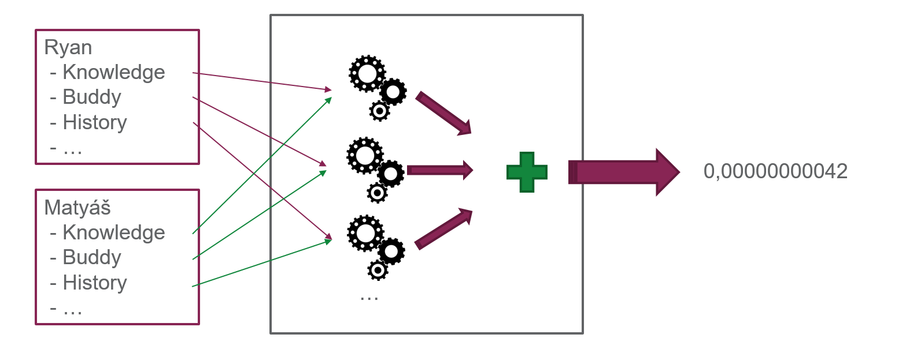
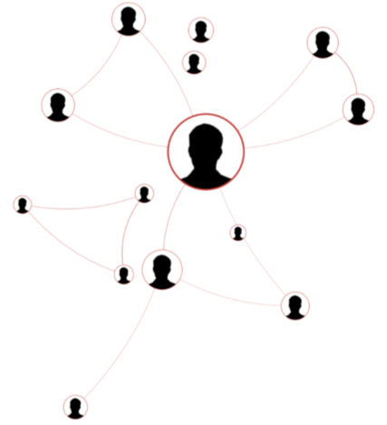
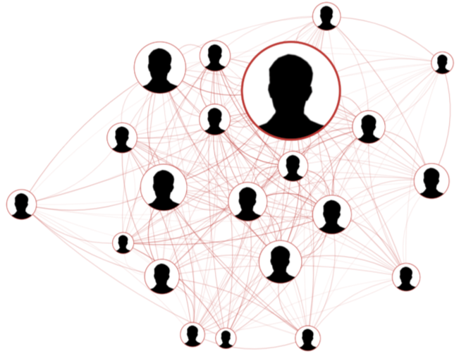
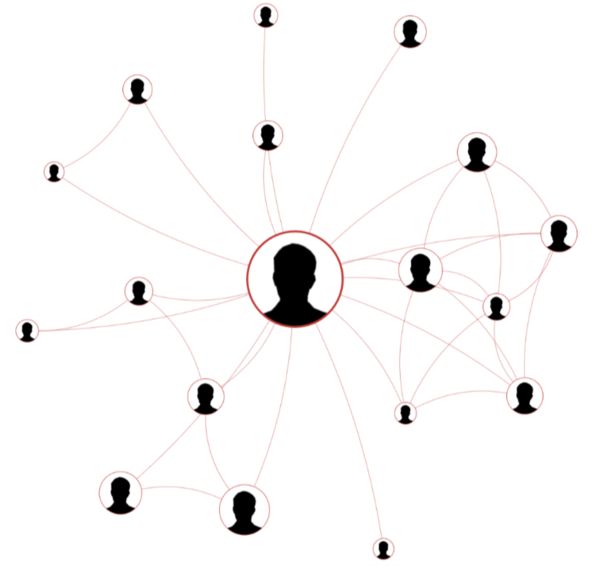
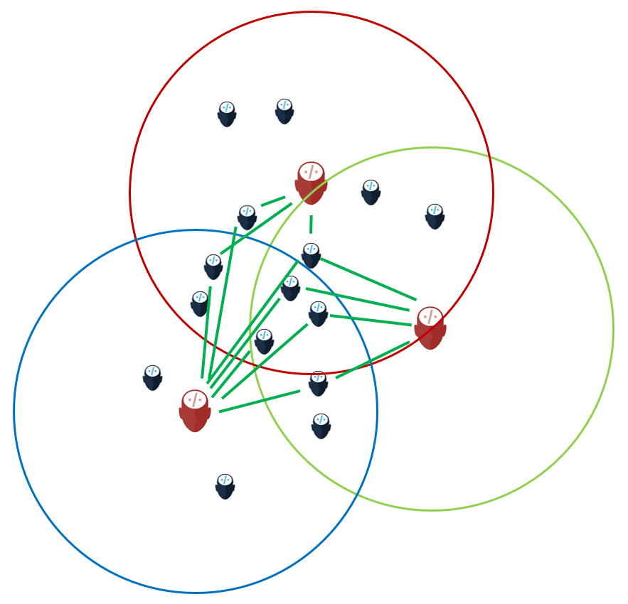
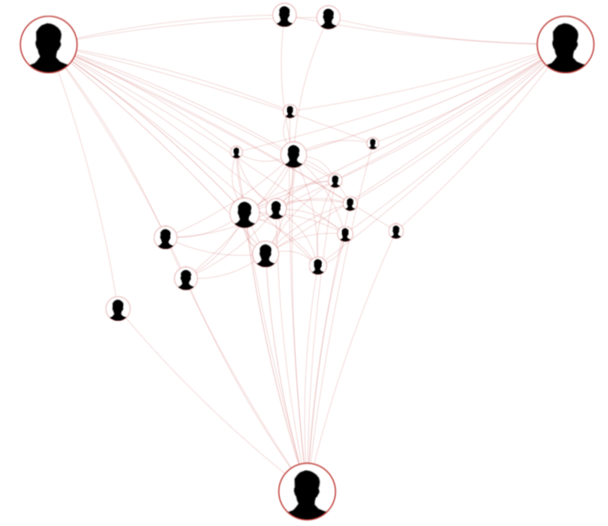
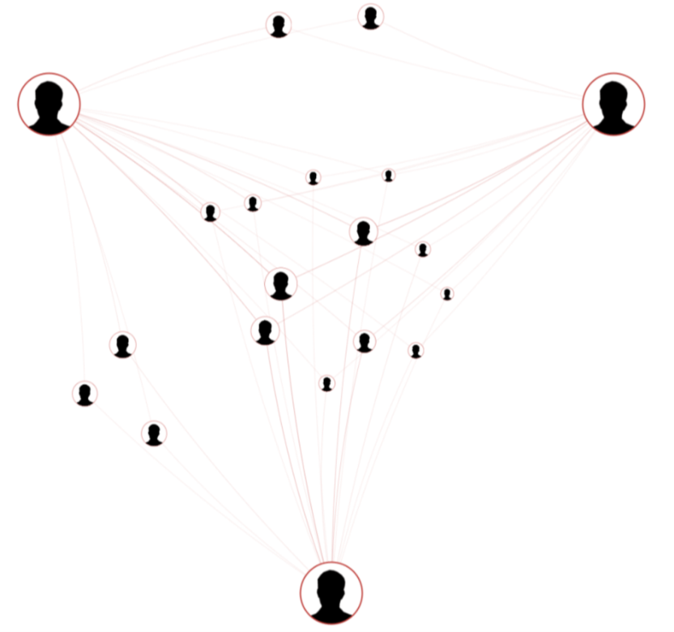

# PPS Catalogue Technical Documentation

In this section, we will explore the inner workings of the PPS Catalog. We'll begin by unraveling the algorithm at the core of the system—an approachable yet effective method that defines the similarity search process. Once we establish a foundational understanding of the algorithm, we'll proceed to dissect the architecture of its features. This will empower you, as a developer, to extend and enhance the capabilities of the PPS Catalog.

## The Brains Of Catalogue

At the heart of the PPS Catalog is a multifaceted algorithm that orchestrates various crucial processes, including data harvesting and preprocessing, similarity computation, graph construction, and the subsequent rendering of the resulting graphs.

### Similarity Algorithm

The PPS Catalog's similarity algorithm serves as the bedrock for identifying similarities among employees at Profis. Operating within metric spaces, the algorithm assesses the closeness or similarity between individuals based on a range of predefined criteria.

This composite metric incorporates several sub-metrics, each delving into specific aspects of an individual's profile. These sub-metrics encompass factors such as knowledge, educational background, project history, work position, work time commitment (part-time vs. full-time), and the duration of an employee's tenure within Profis.

Weights are assigned to each sub-metric to gauge their significance in the overall similarity calculation. These weights act as coefficients, fine-tuned during the algorithm's development to align the model with real-world observations. This meticulous tuning ensures that the similarity scores generated accurately reflect the nuanced relationships and characteristics within the Profis workforce.



#### Sub Metrics

Detailed explanations of each sub-metric are omitted due to potential changes in implementation. Interested parties can refer to the actual implementation (see class EmployeeMetricSpace) for up-to-date information. The sub-metrics, covering various facets of employee profiles, are designed for clarity and ease of understanding.

### Graphs Construction

Graphs, as opposed to tables, provide a more comprehensive and visually insightful representation of relationships among employees. In a graph, relationships between resulting employees are visible, enhancing interpretability.

#### Single Centered Graph

The construction of a single centered graph begins with identifying a queried employee. Subsequently, a specified number (n) of closest employees to the queried individual are found, becoming nodes in the constructed graph. Edges between the queried (center) employee and each found employee are created, with weights assigned based on the closeness of the given pair. Further, edges between other employees are established based on a threshold determined through experimentation. To prevent overfilling the graph with edges, a maximum edge-per-node density was introduced.


*Insufficient edges in this graph result in a disconnected network. To address this, edges are strategically created between the queried (center) employee and the resulting employees. This fosters a more interconnected graph, enhancing the representation of relationships within the Profis workforce.*

---


*Conversely, an excess of edges in this graph leads to noise and reduced readability. To maintain clarity, the algorithm limits the number of edges by introducing a maximum edge-per-node density. This adaptive approach caters to varying node counts in different queries, preventing information overload and preserving the graph's interpretability.*

---


*In the ideal scenario depicted above, the graph strikes a balance with an optimal number of edges, providing a clear and interpretable representation of relationships among employees. This balance ensures that the graph conveys meaningful insights without overwhelming the viewer with excessive detail.*

#### Multiple Centered Graph

In the case of a multiple centered graph, a similar process unfolds. However, the definition of "closest" is altered to account for the presence of multiple employees in the query. An experimentally determined threshold is used to identify if one employee is similar to another. Priority is given to employees who exhibit similarity with more individuals from the query. In cases of a tie, the sum of distances from all employees in the query determines the better candidate for inclusion in the resulting graph. Edges are then created only between employees in the result, based on a threshold. This approach minimizes noise and enhances the clarity of the graph.


*In this visual representation, employees are selected for inclusion in the graph based on their 2D position. A circle is drawn around the center employee, and an employee is considered better if it belongs to more circles, illustrating the criteria for creating the multiple centered graph.*

---


*In this illustration, edges are present between employees other than the center and resulting employees, introducing noise into the graph. This noise arises from connecting employees inside the result set. Such connections were found to hinder graph interpretability.*

---


*The optimal multiple centered graph above showcases edges exclusively between one or more center employees and resulting employees. This focused approach significantly enhances clarity, presenting a clear and interpretable visualization of relationships among employees based on the specified query parameters.*

### Graph Rendering

Graph rendering in the PPS Catalog utilizes the principle of force-directed layout, a widely recognized approach in graph visualization. The force-directed layout relies on simulating physical forces between nodes, striving to find an equilibrium that positions nodes in a way that minimizes overlapping and optimizes the overall aesthetics of the graph.

In our context, the force-directed layout is employed to arrange nodes and edges in a visually pleasing manner, ensuring that the relationships among employees are presented in a clear and comprehensible fashion. By simulating attractive forces between connected nodes and repulsive forces between all nodes, the graph rendering algorithm dynamically adjusts the positions of nodes until an optimal layout is achieved.

### Data Harvesting and Preprocessing

The data harvesting and preprocessing phase in the PPS Catalog involves the collection of fields from the Profis database. Each field corresponds to essential information about employees, and the exact implementation details can be explored in the source code for clarity.

A notable exception is the "Knowledge" field, sourced from the knowledge matrix. As each employee typically possesses around 300 knowledge entries, employing the full matrix in calculations could lead to challenges in efficiency and interpretability. To address this, Singular Value Decomposition (SVD) is applied to reduce the dimensionality of the matrix.

**Reasons for Using SVD:**

1. **Dimensionality Reduction:** SVD effectively reduces the dimensionality of the knowledge matrix, making it computationally more efficient.
2. **Noise Reduction:** SVD aids in filtering out noise and focusing on the most significant patterns in the data, improving the robustness of the knowledge metric.
3. **Efficiency:** SVD enhances computational efficiency without sacrificing interpretability, as the specific numerical values are not used directly in the similarity algorithm.

By employing SVD in the preprocessing phase, the PPS Catalog ensures that the "Knowledge" field contributes meaningfully to the similarity algorithm while addressing computational considerations. The use of SVD also aligns with best practices for enhancing efficiency without compromising the interpretability of the knowledge metric.

## Architecture

Every module in Profis adheres to a standard architecture, namely `API endpoint > Facade > Operation > Repository`. While most of the code follows familiar patterns, in this section, we delve into the higher architecture of specific features and the rationale behind it.

### Graph Construction

Let's explore the core of the entire application: graph construction. As mentioned earlier, we have defined two types of graphs—single centered (querying the neighborhood of one employee) and multiple centered (querying multiple employees and expecting a shared neighborhood). Despite their differences, both graphs share the same logical structure:

1. **Algorithm Configuration:** During this phase, a metric space is created, and necessary configurations are fetched from the database.
2. **Employee Fetching:** All employees are retrieved from the database, and the center one (or ones) is separated from the rest.
3. **Neighborhood Search:** This phase defines a resulting set of employees, i.e., the nodes of the graph.
4. **Edge Definition:** Here, we define the edges of the resulting graph based on the set of employees from the previous step.
5. **Mapping to DTOs:** Finally, employees and information about them are converted to DTOs for the front-end to render.

To achieve this, a template method pattern has been employed. A [template method](https://refactoring.guru/design-patterns/template-method) defines the skeleton of an algorithm in the superclass but lets subclasses alter specific steps of the algorithm without changing its structure. In the context of this application, the base class is named `CreateGraphOperationBase<EmployeeDistanceT, GraphSettingsT>`, with two children: `CreateMultipleCenteredGraphOperation<...>` and `CreateSingleCenteredGraphOperation<...>`. The abstract methods that need to be implemented correspond to steps 3 and 4:

```csharp
IList<EmployeeInMetricSpace> GetNearestEmployeesFromCenter(/*...*/);

IList<EmployeeGraphEdge> GetEdges(/*...*/);
```

Additionally, two more technical methods exist, to be implemented by the child class:

```csharp
// Since distance is encapsulated within the class `EmployeeDistanceT`, converting it
// into a meaningful representation for node size requires insight from the child
// class. It needs to provide an estimation of how far, in relative terms, 
// a given employee is from the center.
double GetDistanceForNodeSizeEvaluation(EmployeeInMetricSpace empl);

// Fetches the specific graph construction settings. While the child class can define 
// its unique settings through `GraphSettingsT`, certain settings are integral to 
// the base class. It is the responsibility of the child class to retrieve and 
// provide these settings for seamless operation.
GraphSettingsT GetGraphSettings();
```

This architecture allows flexibility and extensibility while maintaining a consistent structure across different graph construction scenarios.

*Note: The base class has two generic parameters: `EmployeeDistanceT` (representing the metric space distance type) and `GraphSettingsT` (representing the settings specific to graph construction).*

### Metric Space Definition

As previously highlighted, the metric space is a cornerstone of the entire application. While the intricacies of its implementation can be deciphered from the source code, offering a concise overview serves as a valuable reference for future expansions or modifications of the metric space.

At its core, the `EmployeeMetricSpace` class revolves around a crucial concept: the composition of various metrics. This composition is achieved through a list of partial metrics—functions responsible for computing specific metric aspects along with their associated weights.

```csharp
List<(double weight, MetricOnEmployees partialMetric)> metricComponents;
```

This list, meticulously crafted during the class's construction, stands as a pivotal junction where one can seamlessly influence the metric's behavior, fostering flexibility and adaptability.

The singular point of interaction with this metric space lies in the public method:

```csharp
double GetDistance(EmployeeForMetricEvaluationModel empl1, EmployeeForMetricEvaluationModel empl2);
```

True to its name, this method orchestrates the amalgamation of all partial metrics from the aforementioned list, distilling the essence of the metric space into a comprehensive similarity score. It serves as the gateway for evaluating the nuanced distances between employee profiles, encapsulating the multidimensional nature of the similarity algorithm.
